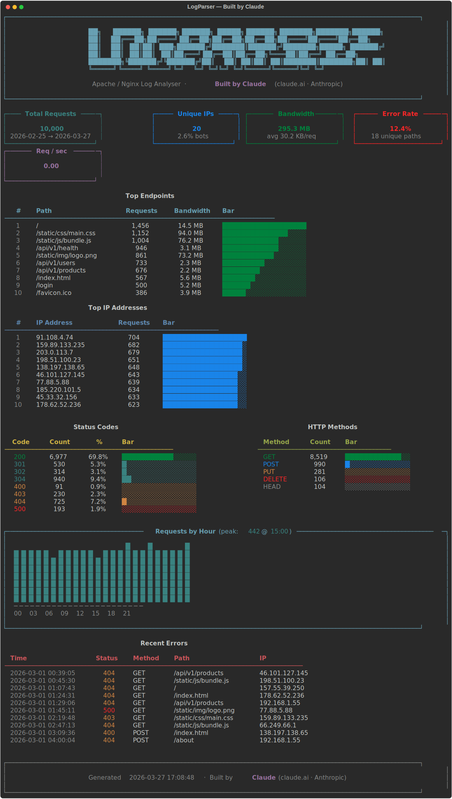
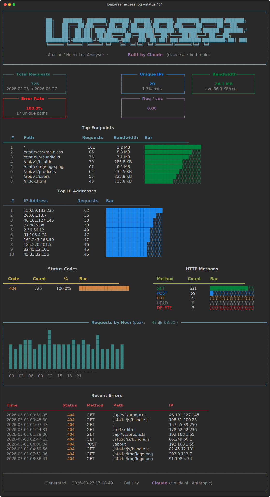
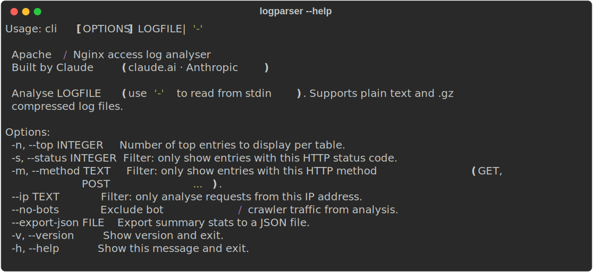

# LogParser

> **Built by [Claude](https://claude.ai) (Anthropic)**
> An intelligent Apache / Nginx access log analyser with a rich terminal dashboard.


---

## Dashboard



---

## Filtering — `--status 404`



---

## CLI options



---

## What it does

LogParser parses Apache and Nginx access logs and renders an interactive terminal dashboard showing:

- **Summary stats** — total requests, unique IPs, bandwidth transferred, error rate, req/sec
- **Top endpoints** — most-hit paths with bandwidth and visual bar charts
- **Top IPs** — highest-traffic client addresses
- **Status code breakdown** — per-code counts and percentages with colour coding
- **HTTP method distribution** — GET / POST / PUT / DELETE breakdown
- **Hourly traffic chart** — ASCII bar chart of requests across the 24-hour clock
- **Recent errors** — last 20 4xx / 5xx entries with timestamp, path, and IP

Supports plain `.log` files and gzip-compressed `.log.gz` files. Can also read from stdin.

---

## Built with Claude

This project was designed and written entirely by **Claude** (claude.ai), Anthropic's AI assistant.
Every module — from the regex parser to the Rich dashboard — was authored through a conversation.

---

## Installation

```bash
git clone https://github.com/SaVi456/LogParser.git
cd LogParser
pip install -e .
```

Once installed, the `logparser` command is available system-wide:

```bash
logparser access.log
```

**Requirements:** Python 3.10+

---

## Quick start

```bash
# Generate sample logs for demo
python generate_sample_logs.py

# Run the dashboard
logparser sample_logs/access.log

# Or without installing:
python main.py sample_logs/access.log
```

---

## Usage

```
logparser LOGFILE [OPTIONS]

Arguments:
  LOGFILE   Path to the log file, or '-' to read from stdin

Options:
  -n, --top INTEGER       Number of top entries per table  [default: 15]
  -s, --status INTEGER    Filter to a specific HTTP status code
  -m, --method TEXT       Filter to a specific HTTP method (GET, POST ...)
      --ip TEXT           Filter to requests from a specific IP address
      --no-bots           Exclude detected bot / crawler traffic
      --export-json FILE  Export summary stats to JSON
  -v, --version           Show version and exit
  -h, --help              Show this message and exit
```

### Examples

```bash
# Analyse a log file
logparser /var/log/nginx/access.log

# Show only 404 errors
logparser access.log --status 404

# Exclude bots, show top 20 endpoints
logparser access.log --no-bots --top 20

# Filter to a single IP address
logparser access.log --ip 82.45.12.101

# Read from stdin (pipe)
cat access.log | logparser -

# Read a gzip-compressed log
logparser access.log.gz

# Export stats to JSON for further processing
logparser access.log --export-json stats.json
```

---

## Sample log generator

```bash
# 5,000 entries, last 30 days (default)
python generate_sample_logs.py

# 50,000 entries, last 90 days, gzip compressed
python generate_sample_logs.py -n 50000 --days 90 --gz
```

---

## Project structure

```
LogParser/
├── log_parser/
│   ├── __init__.py      # Package metadata
│   ├── parser.py        # Regex parser — LogEntry dataclass
│   ├── analyzer.py      # Stats aggregation — Stats dataclass
│   ├── dashboard.py     # Rich terminal dashboard renderer
│   └── cli.py           # Click CLI entry point
├── tests/
│   ├── conftest.py      # Shared fixtures
│   ├── test_parser.py   # 50 parser tests
│   └── test_analyzer.py # 36 analyzer tests
├── scripts/
│   └── generate_screenshots.py  # Regenerate docs/img/ SVGs
├── docs/img/            # Dashboard screenshots (SVG)
├── .github/workflows/
│   └── ci.yml           # CI: test on Python 3.10 / 3.11 / 3.12 + lint
├── main.py              # Thin shim for python main.py usage
├── generate_sample_logs.py
├── pyproject.toml       # Package metadata + console script entry point
└── requirements.txt
```

---

## Log format

LogParser handles the **Apache Combined Log Format** (also the default Nginx format):

```
%h %l %u %t \"%r\" %>s %b \"%{Referer}i\" \"%{User-Agent}i\"
```

Example:
```
82.45.12.101 - - [27/Mar/2026:14:23:01 +0000] "GET /api/v1/users HTTP/1.1" 200 3412 "https://google.com" "Mozilla/5.0 ..."
```

---

## License

MIT — free to use, modify, and distribute.

---

*Built by [Claude](https://claude.ai) · Anthropic*
